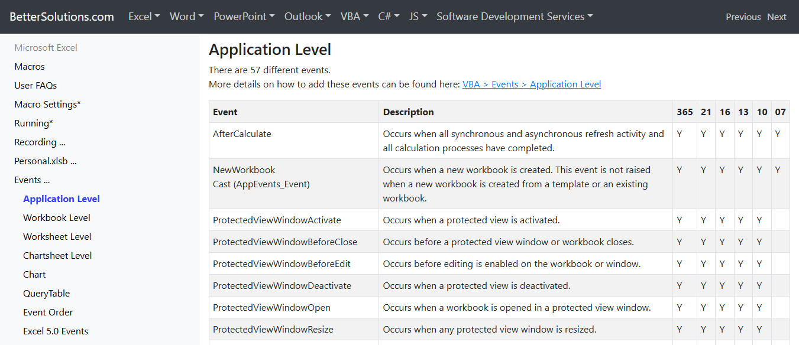

# PoC-ExcelPersistence
Uma tecnica utilizada atualmente baseada em Macros do Office

---

Por padrao, no office, as Macros sao desativadas e para executa-las, precisamos habilita-las. Mas, existe uma tecnica capaz de criar persistencia, ou utilizada ate para criacao de malwares. Essa tecnica ainda esta funcional no dia de hoje `22/06/2025` na versao atual do office (Office 2024).

Essa tecnica utiliza da extensao `*.xlam` do Excel, ela se baseia na criacao de Macros para execucao de codigo malicioso, as macros sao escritas em VBA (Visual Basic for Applications).

Essa tecnica foi utilizada em um malware descoberto recentemente, os autores foram o grupo`APT36`, tambem conhecido como "Transparent Tribe". Eh um grupo de APTs (Advanced Persistent Threat) do Paquistao.

A Macro, nada mais eh do que um codigo VBA (VBApplication), ela eh baseada em Visual Basic, o site https://bettersolutions.com/ tem um material interessante mostrando alguns eventos que podem ser possiveis de explorar. Alguns Eventos sao chamados de forma automatica, e esses sao os mais interessantes de se mirar.

O que nos interessa e iremos utilizar, sera o `Workbook_Open`

Esse evento tambem foi usada pelos APTs.

A extensao `.xlam` (Excel Macro Enable Add-in) eh uma extensao de "add-in", ela contem macros VBA e outras funcionalidades, como funcoes personalizadas. Acontece que, existe uma pasta do Excel chamada de `XLSTART`, ela fica em `%appdata%\Roaming\Microsoft\Excel\XLSTART` (Se nao existir voce pode apenas criar), essa eh uma pasta de **inicializacao automatica do Excel**, tudo que colocarmos nela sera automaticamente aberto sempre que o excel inciar, ou seja, independente da funcao que usarmos (desde que seja funcional), o codigo sera executado de qualquer forma.

E com essa informacao, usaremos isso para iniciar nosso metodo de **persistencia**, mesmo quando o user for verificar as Macros existentes, nao ira aparecer. Com isso, poderiamos inserir uma payload de shell reversa, assim fica a nossa Macro, bem simples

Agora, salvamos na pasta de inicializacao

E por fim, sempre que a vitima abrir o excel, ele vai executar nosso codigo malicioso e conectar uma shell reversa em nossa maquina, assim concluindo a nossa persistencia.

Obviamente, isso eh facilmente pego pelo Windows Defender e bloqueado por firewalls, nessa PoC nao iremos aprofundar em evasao nem nada do tipo, mas eh sim completamente possivel! Nossa payload eh facilmente pega por causa de sua assinatura, eh uma payload generica e 99% dos AVs ja tem conhecimento sobre.

Essa tecnica pode ser utilizada em malwares (como ja foi feita) e espalhada em campanhas de phishing, eh uma tecnica ja conhecida mas nao muito usada, tem um grande potencial de risco por se tratar de um arquivo supostamente "confiavel". 

Veja que, mesmo sendo um payload generico, nem todos AVs detectaram como malicioso, mesmo sendo **EXPLICITAMENTE** uma reverse shell.

